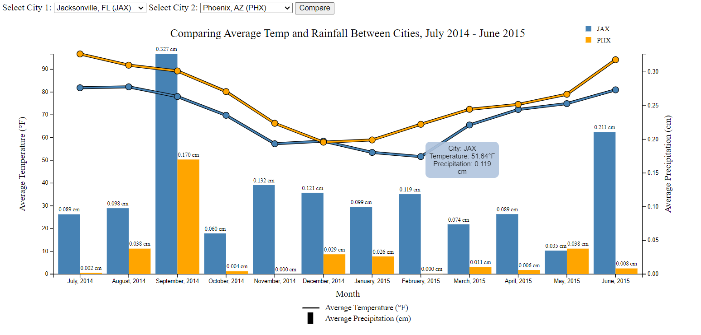

<h1>Final Project Overview</h1>

<h3>Design Overview:</h3>

This visualization is a layered line and bar graph that compares the average temperature and precipitation between cities between July 2014 and June 2015. The lines represent the average temperature (in Fahrenheit) in the respective cities for that month, while the bars represent the average precipitation (in centimeters) in the respective cities for that month. The y-axis displays both of these values, with average temperature on the left and average precipitation on the right. Users can choose between different cities to compare these values within the select menu top left (there is an alert that is created when users try to compare the same city). 

There is a legend on the top right corner that helps differentiate between the two colors and their city, and there is also a legend on the bottom of the visualization that helps viewers understand what the bars and lines represent. The data points on the line are enlarged so viewers can clearly see where the line is at the month mark. Users can also hover their mouse over these points to get the exact temperature and precipitation values for that city. The bars are also additionally labeled with the average precipitation value for ease of viewing. With this design, users can discover trends on how temperature and rainfall changes over the time of year, and how these two values might correlate to each other. Instead of having to look at two different visualizations, viewers can easily match the line and bar graph trends on one easy viewpoint. Additionally, users can compare the trends of one city to another city, which could help discover differences between each location and its values.

<h3>Example User Tasks Supported:</h3>

- As a traveler, I want to be able to find the average temperature in February for Chicago, IL, so I know whether or not it will be good for travel or not.

  - Using the visualization, we can select Chicago, IL (MDW) as one of the cities. Viewing the line, we can see a dip in temperature as it visually drops as the lowest point on the graph. We can even use the tooltip and hover the point, and find that the average temperature is 18.39 degrees Fahrenheit, making it undesirable for travel.

- As a farmer in Indianapolis, IN, I want to know which month has the most rainfall because I want to plant some seeds that need a lot of rainwater to grow.
  
  - Using the visualization, we can select Indianapolis, IN (IND). Viewing the bars, we can see that IND gets the most rainfall in the month of June, with an average precipitation of 0.279 centimeters, making that month the best time to plant seeds.

- As a homebuyer who enjoys good weather, I want to know whether I should look for houses in Jacksonville, FL or Phoenix, AZ so that I know where to have high temperatures and little rain.
  
  - Using the visualization, we can select both Jacksonville, FL (JAX) and Phoenix, AZ (PHX). Viewing the lines, we can tell that both cities have similar high temperature trends, and they do not fluctuate much, keeping both cities a qualified choice for the homebuyer. However, by viewing the bars, we can also see that JAX has trends of a lot more average precipitation over the year over PHX, making PHX the better choice for this homebuyer who wants minimal rain.
 
<h3>Screenshot:</h3>

